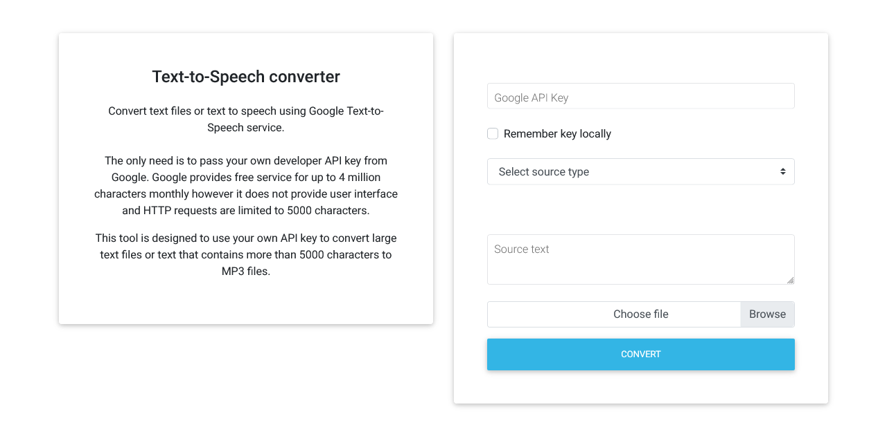

# Text-To-Speech Web
### A web application for converting a text file to speech.

The goal of this project is to create a web application that serves as a tool for converting a text file into speech using Google Text-to-Speech.

## Getting Started

These instructions will get you a copy of the project up and running on 
your local machine for development and testing purposes.

### Prerequisites

* Node.js [15.5.0 or above] - https://nodejs.org/
* npm [7.3.0 or above] - https://www.npmjs.com/

Detailed information about installation and configurations are provided at developers' site.

## Technology Stack

* Angular [8.2.9+]
* TypeScript
* SCSS
* JavaScript

### Build 

A step by step instruction [on Windows 10]:
* Navigate to project directory in Command Prompt (cmd).
* Run `ng serve` to start application's local development server. 
* Navigate to `http://localhost:4200/` in your browser. 

The application will automatically reload if you change any of the source files.

## Preview

<table>
    <tr>
        <td>
            
Homepage

            
        </td>
    </tr>
</table>

## Author

* **Michał Koziara** 
